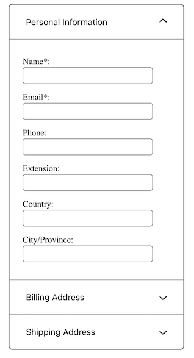

# Accordion

## Prior Art

The Accordion pattern is a very common one on the web, and there's plenty to think about when it comes to making it accessible. I'm going to give myself a headstart by taking the HTML and CSS directly from the Accordion Example included in the <a href="https://www.w3.org/WAI/ARIA/apg/patterns/accordion" target="_blank">ARIA Authoring Practices Guide (APG)</a>. The APG is always my first port of call when considering accessibility for common patterns like this. I'm going to leave out the JavaScript provided with the example because I'm going to re-implement that myself using Dynamo.

## Progressive Enhancement

The first thing that I notice when opening the document in my browser is that the second and third panels of the accordion are closed by default. If JavaScript isn't turned on or, more likely, if a prior JavaScript error means that the accordions JavaScript never runs, that's going to render the majority of my accordion content inaccessible. To remedy this problem I'm going to remove the `hidden` attribute from each of the panels so that the content is _all_ accessible by default. I will then hide the panels again with Dynamo once it's initialised. This is a perfect example of how applying Progressive Enhancement can make for a more resilient web: If there is no JavaScript then everything still works, but if there _is_ JavaScript then we can make it even better.

I can apply the same principles elsewhere, for example the aria attributes such as `aria-controls` are irrelevant until Dynamo is up an running so I can defer adding such attributes until I'm sure that the behaviour matches the description.

<p>
    
        <br/>
    The accordion with second and third panels closed by default
</p>

## Introducing Dynamo

The first thing I will do is create an Accordion function that will take a _root node_ and then pass it to Dynamo with the required configuration...

```js
import { Dynamo } from "/dynamo.js"

export const Accordion = (rootNode) =>
  Dynamo(rootNode, {
    // config here...
  })
```

and then in my HTML file I will add a script to import that function and invoke it, passing the root node from the existing markup...

```html
<script type="module">
  import { Accordion } from "./index.js"

  const rootNode = document.getElementById("accordionGroup")

  Accordion(rootNode)
</script>
```

I want my accordion to only ever have _one panel open at a time_. To implement that behaviour I'm going to need a state variable to store a number representing the positional index of the panel that is currently open. Dynamo configuration accepts a `state` property which can be assigned an object with any values required for the initial state. I'm going to add a single property named `openPanel` with a value of `0` to indicate that the first panel should be open.

```js
import { Dynamo } from "/dynamo.js"

export const Accordion = (rootNode) =>
  Dynamo(rootNode, {
    state: {
      openPanel: 0,
    },
  })
```

Another useful configuration property is `dom`; this property allows me to provide Dynamo with a dictionary of functions that derive some Element attributes and/or properties from the current state. Whenever there is a change in state, these functions will all be invoked and the objects they return will be used by Dynamo to update any Element nodes that reference them. I want my accordion panels to be hidden _unless_ they are the current `openPanel`, so I've created a entry here named `panel`, with a function that takes the current state and the node index, and then returns an object with a single `hidden` property.</p>

```js
import { Dynamo } from "/dynamo.js"

export const Accordion = (rootNode) =>
  Dynamo(rootNode, {
    state: {
      openPanel: 0,
    },
    node: {
      panel: (state, i) => ({
        hidden: state.openPanel !== i,
      }),
    },
  })
```

My example so far isn't going to do very much, to make everything work I will also need to tell Dynamo _which_ nodes are controlled by this configuration by applying the `x-node` attribute to the relevant DOM elements.

I've added an `x-node="panel"` attribute to each of the `div` panels and now, when I reload the page, I can see that the second and third panels are both closed. If I disable JavaScript and reload the page then all of the panels are expanded and the content is still accessible.

```html
<div id="accordionGroup" class="accordion">
  <h3>...</h3>
  <div
    role="region"
    class="accordion-panel"
    aria-labelledby="accordion1id"
    x-node="panel"
  >
    ...
  </div>
  <h3>...</h3>
  <div
    role="region"
    class="accordion-panel"
    aria-labelledby="accordion2id"
    x-node="panel"
  >
    ...
  </div>
  <h3>...</h3>
  <div
    role="region"
    class="accordion-panel"
    aria-labelledby="accordion2id"
    x-node="panel"
  >
    ...
  </div>
</div>
```

Now I'm going to replicate the same approach with the accordion trigger buttons and add a `x-node="trigger"` attribute to each of them so that I can also configure their attributes from state in a similar way. I will remove the `aria-controls`, `aria-expanded`, and also the `id` attributes from each of these trigger buttons in the HTML so that I can provide and/or control those attributes from my Dynamo node function.

```html
<div id="accordionGroup" class="accordion">
  <h3>
    <button type="button" x-node="trigger">...</button>
  </h3>
  <div role="region" class="accordion-panel" x-node="panel">...</div>
  <h3>
    <button type="button" x-node="trigger">...</button>
  </h3>
  <div role="region" class="accordion-panel" x-node="panel">...</div>
  <h3>
    <button type="button" x-node="trigger">...</button>
  </h3>
  <div role="region" class="accordion-panel" x-node="panel">...</div>
</div>
```

```js
import { Dynamo } from "/dynamo.js"

export const Accordion = (rootNode) =>
  Dynamo(rootNode, {
    state: {
      openPanel: 0,
    },
    node: {
      trigger: (state, i) => ({
        id: `trigger_${i}`,
        ariaControls: `panel_${i}`,
        ariaExpanded: state.openPanel === i,
      }),
      panel: (state, i) => ({
        id: `panel_${i}`,
        ariaLabelledby: `trigger_${i}`,
        hidden: state.openPanel !== i,
      }),
    },
  })
```

The last thing that I need to do is add the trigger functionality so I'm going to add the `x-on="click:togglePanel"` attribute to each of my trigger buttons. This tells Dynamo that when the button receives a `click` event then it should invoke the `togglePanel`_action handler_. Much like our `node` update function, Dynamo also accepts a dictionary of named `action` handler functions. These special functions receive the _current state_ as their first argument and return the _next state_.

```js
import { Dynamo } from "/dynamo.js"

export const Accordion = (rootNode) =>
  Dynamo(rootNode, {
    state: {
      openPanel: 0,
    },
    action: {
      togglePanel: (state, { index }) => ({
        ...state,
        openPanel: state.openPanel === index ? -1 : index,
      }),
    },
    node: {
      trigger: (state, i) => ({
        id: `trigger_${i}`,
        ariaControls: `panel_${i}`,
        ariaExpanded: state.openPanel === i,
      }),
      panel: (state, i) => ({
        id: `panel_${i}`,
        ariaLabelledby: `trigger_${i}`,
        hidden: state.openPanel !== i,
      }),
    },
  })
```
